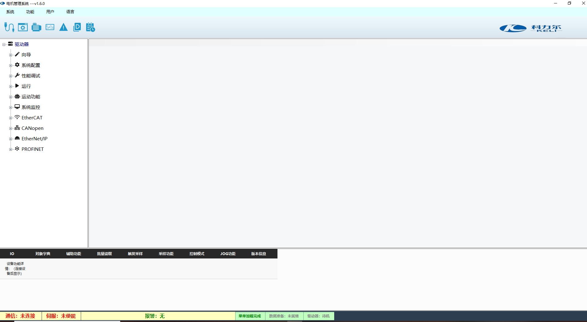
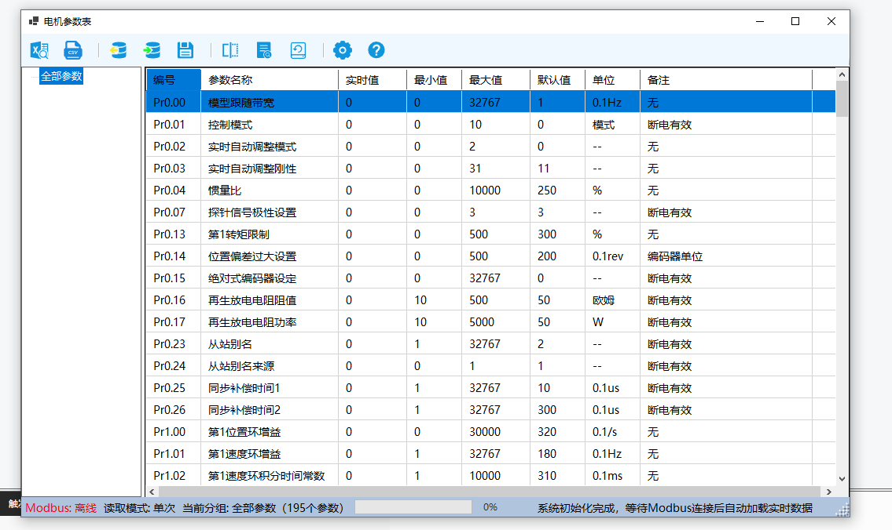
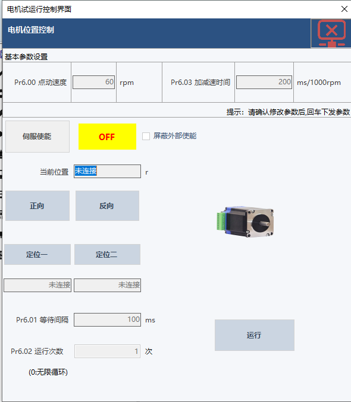
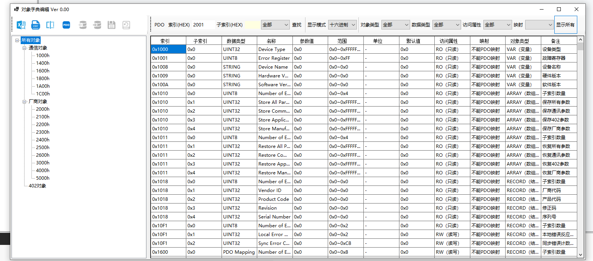
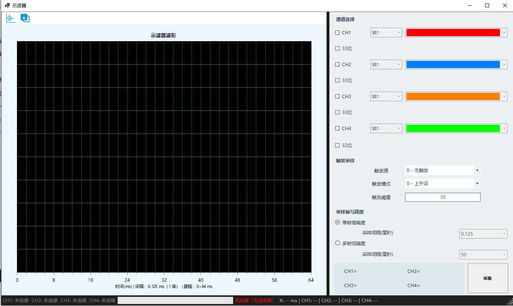

# IndustrialForms

工业级 WinForms 上位机 UI 框架 · .NET 10

> 本项目为**作品展示**，用于呈现独立设计工业上位机桌面应用架构与界面的能力。源代码不开源，如需了解详情或合作，欢迎联系作者。

---

## 项目简介

一套面向工业上位机 / HMI 桌面应用场景的 WinForms 应用框架，具备清晰的分层架构与完整的工程化能力，可支撑步进电机、伺服驱动等工业设备的 PC 端配置、监控与调试软件。

---

## 技术栈

- **框架**：.NET 10 + WinForms（纯代码构建 UI，无 Designer 文件）
- **架构**：依赖注入分层（基础设施 / 框架 / 表现 / 数据四层）
- **数据**：SQLite 单文件持久化（参数 + 通信协议，零配置免安装）
- **多语言**：中文基准 + 运行时映射，语言切换事件驱动
- **日志**：分级、调用方溯源、按天滚动落盘

---

## 核心能力

| 能力 | 说明 |
| --- | --- |
| 依赖注入分层 | 基础设施 / 窗体分层装配，职责清晰、易于扩展 |
| 子窗体管理 | 单例复用、嵌入宿主面板，避免重复打开叠加 |
| 导航树布局 | 左侧导航 + 右侧内容区 + 底部状态栏经典三段式 |
| SQLite 数据层 | 参数与通信协议单文件持久化，现场部署免装数据库 |
| 多语言 | 语言切换事件驱动，全窗体自动刷新 |
| 日志系统 | 分级、调用方溯源、按天滚动、历史回填 |

---

## 界面展示

### 主界面

工业上位机主界面，采用左侧导航树 + 右侧内容区 + 底部状态栏的经典三段式布局，集成设备连接、参数配置、运动控制、状态监控等主要功能入口，顶部菜单栏支持中英文切换。

### 电机参数表

电机参数读写界面，以表格形式展示参数的编号、名称与当前值，支持参数在线修改、导入导出与批量读写，参数统一持久化到 SQLite 数据库。

### 电机运动控制

运动控制操作界面，提供点动、定位、速度模式等控制方式，实时回显电机的运行状态、当前位置与目标值，用于调试与手动操作。

### 对象字典界面

通信对象字典查看界面，展示对象索引、子索引、数据类型与读写属性，用于协议调试与对象映射排查。

### 示波器界面

实时波形示波器，多通道显示速度、位置、电流等曲线，支持缩放、游标测量与数据导出，用于运动过程分析。

---

## 联系作者

- 邮箱：[wanghaochenemail@163.com](mailto:wanghaochenemail@163.com)
- GitHub：[ygwzwhc](https://github.com/ygwzwhc)
