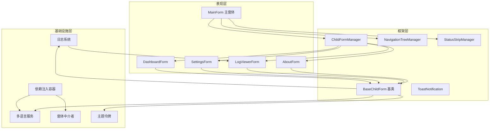

# IndustrialForms

工业级 WinForms 上位机 UI 框架 · .NET 10

一个面向工业上位机 / HMI 桌面应用场景的 **WinForms UI 框架骨架**。它把一套成熟的桌面端架构（依赖注入、多语言、日志、子窗体管理、导航布局）沉淀为可复用的模板，让新项目从"搭架构"中解放出来，专注于业务本身。

> 本项目为框架演示代码，不包含任何具体设备的通信协议、寄存器定义或业务参数。

---

## 特性

| 能力 | 说明 |
| --- | --- |
| 依赖注入分层 | 基于 `Microsoft.Extensions.DependencyInjection`，基础设施 / 窗体分层装配 |
| 多语言 | 中文基准 + 运行时映射，语言切换事件驱动，全窗体自动刷新 |
| 日志系统 | 分级（Debug/Info/Warn/Error）、调用方溯源、按天滚动落盘、历史回填 |
| 子窗体管理 | 单例复用、嵌入宿主面板，避免重复打开叠加 |
| 导航树布局 | 左侧导航树 + 右侧内容区 + 底部状态栏，上位机经典三段式 |
| 主题令牌 | 颜色与字体集中定义，全站统一切换风格 |
| Toast 提示 | 右下角滑入式通知，渐变、动画、重复过滤 |
| 窗体基类 | 统一提供跨线程调用、生命周期钩子、异步加载信号、资源释放 |

---

## 架构设计

核心思想：**UI 与业务解耦，能力通过基类与基础设施下沉，窗体只写自身逻辑。**



---

## 项目结构

```
IndustrialForms/
├── src/IndustrialForms/
│   ├── Program.cs                     # 应用入口
│   ├── DependencyInjection.cs         # 服务装配中心
│   ├── Common/                        # 通用工具
│   │   ├── ControlExtensions.cs       # 跨线程、控件查找等扩展
│   │   └── DataGridViewHelper.cs      # 表格统一样式
│   ├── Core/
│   │   ├── Logging/                   # 日志系统
│   │   │   ├── Logger.cs
│   │   │   ├── LogFileManager.cs
│   │   │   └── LogLevel.cs
│   │   ├── Localization/              # 多语言
│   │   │   ├── ILanguageService.cs
│   │   │   └── LanguageService.cs
│   │   ├── Messaging/                 # 窗体间通信
│   │   │   └── FormMediator.cs
│   │   └── Theming/                   # 主题与提示
│   │       ├── ThemeColors.cs
│   │       └── ToastNotification.cs
│   ├── Framework/                     # 框架核心
│   │   ├── BaseChildForm.cs           # 子窗体基类
│   │   ├── ChildFormManager.cs        # 子窗体管理
│   │   ├── NavigationTreeManager.cs   # 导航树
│   │   └── StatusStripManager.cs      # 状态栏
│   └── UI/                            # 窗体
│       ├── MainForm.cs                # 主窗体
│       ├── DashboardForm.cs           # 示例：仪表盘
│       ├── SettingsForm.cs            # 示例：设置
│       ├── LogViewerForm.cs           # 日志查看器
│       └── AboutForm.cs               # 示例：关于
└── IndustrialForms.sln
```

---

## 快速开始

环境要求：`.NET 10 SDK` + Windows。

```bash
dotnet run --project src/IndustrialForms
```

运行后可见：左侧导航树切换页面，右上角菜单可切换中英文，底部状态栏显示实时时钟。

---

## 扩展方式

1. **新增一个业务窗体**：继承 `BaseChildForm`，实现 `InitializeUi()` 构建界面。
2. **注册到导航**：在 `MainForm.BuildLayout()` 中调用 `_navigation.RegisterNode(...)`。
3. **注册到容器**：在 `DependencyInjection.ConfigureServices()` 中 `AddTransient<TForm>()`。
4. **接入真实业务**：在 `Core` 下新增服务层，通过构造函数注入到窗体。

---

## 设计要点

- **窗体单例复用**：`ChildFormManager` 保证同一窗体全局唯一，重复打开只切换焦点。
- **跨线程安全**：`BaseChildForm.InvokeIfRequired` 统一处理后台线程更新 UI。
- **异步加载信号**：`LoadCompletedTask` 让父窗体可等待子窗体加载完成。
- **资源释放**：基类重写 `Dispose`，集中退订事件，避免内存泄漏。
- **日志溯源**：`Logger` 自动记录"类名.方法名"，无需手动传来源。

---

## License

[MIT](./LICENSE)
